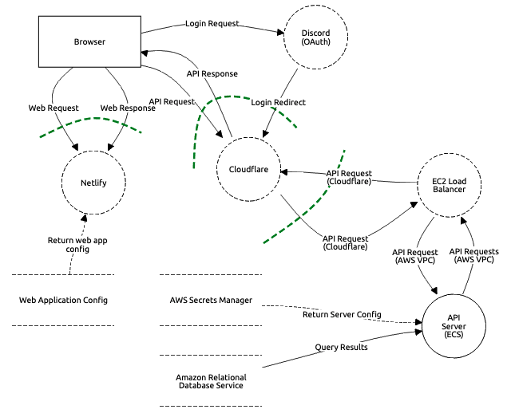

# Overview

This repo contains etournity's main threat-model, which has been created using OWASP's threatdragon program.
You can view and exit the interactive version in their [web app](https://threatdragon.org/#/threatmodel/report/etournity/threat-model/main/Etournity%20Threat%20Model).

# Threats

Below, you can find an overview of the different threats we have identified and mitigated. This list is generated from the output of threatdragon by a small custom script (`generate-report.js`)

## Browser (External Actor)

- ### CSRF Attacks (_Spoofing, Mitigated, High Serverity_) 

  **Description:**
  Malicious parties could forge requests to include cookies with our authentication tokens in requests to our API.

  **Mitigation:**
  Our backend is using a separate domain without access to the cookies and CORS headers only allowing the frontend's domain. Further, all API actions are required to only use application/json body, which mitigates XHR-based CSRF Attacks.

- ### XSS Attacks (_Elevation of privilege, Mitigated, High Serverity_) 

  **Mitigation:**
  React protects us from many forms of XSS attacks and we're avoiding react's `dangerouslySetInnerHTML` feature.
  Further, we employ very strict Content Security Policy.

  One Scenario for XSS would be hijacking Googles Fonts or Tag-Manager services since these are the only allowed external scripts. These however are out of scope.

- ### Leaking Referrer Information (_Information disclosure, Mitigated, Low Serverity_) 

  **Mitigation:**
  We utilize the Referrer-Policy header to completely prevent the browser from leaking information to websites we link to.
   

## API Request (Data Flow)

- ### Insecure SSL Versions/Cyphers and SSL Certificate Security (_Tampering, Mitigated, High Serverity_) 

  **Mitigation:**

  - We have configured Cloudflare to prevent Clients using insecure cyphers and TLS Versions below TLS 1.2 from connecting.

  - We utilize the Expect-CT Header and have Certificate Monitoring setup to prevent and monitor the issuing of unauthorized SSL certificates.

  - Further, we add HTTP Strict Transport Security (HSTS) headers (Strict-Transport-Security) to our requests to mitigate downgrade and session hijacking attacks.
     

## API Request (Data Flow)

- ### Unencrypted Origin Traffic (_Tampering, Mitigated, High Serverity_) 

  **Description:**
  While the connection to cloudflare was encrypted, the request was sent from there over an unencryped connection to our servers.

  **Mitigation:**
  We've deployed SSL Certificates signed by cloudflare to our API Servers to encrypt the connection.
   

## API Server (Process)

- ### High-Complexity Queries (_Denial of service, Mitigated, Medium Serverity_) 

  **Description:**
  A GraphQL query can take arbitrarily many actions, and thus take an arbitrarily large amount of server resources

  **Mitigation:**
  We limit GraphQL queries to a specific cost. Each action has an assigned amount of "points" and requests taking up too many of these get rejected.

- ### Inconsistent Authorization Checks (_Information disclosure, Mitigated, High Serverity_) 

  **Description:**
  There are multiple different paths to access data using a graphql query and this can lead to instances where users can request information they shouldn't have access to.

  This has led to the possible exposure of sensitive user information in early version of the platform.

  **Mitigation:**
  This has been mitigated by using graphql-shield combined with our own rbac implementation to protect resources on a per-field basis.

- ### Components with Known Vulnerabilities (_Tampering, Mitigated, High Serverity_) 

  **Description:**
  From OWASP.org:
  Components, such as libraries, frameworks, and other software modules, run with the same privileges as the application. If a vulnerable component is exploited, such an attack can facilitate serious data loss or server takeover. Applications and APIs using components with known vulnerabilities may undermine application defenses and enable various attacks and impacts.

  **Mitigation:**

  - We are using dependabot for automated dependency updates when packages we are using have a known voulnabillity
  - We pin all dependencies to a specific version and use a lockfile to mitigate issues like NPM libraries getting updated to include malicious code.

- ### Docker Security Issues (_Elevation of privilege, Mitigated, Medium Serverity_) 

  **Mitigation:**

  - We mitigate most common Docker Security issues by using Amazon Elastic Container Service, a managed docker solution that handles security updates for our docker runtime and protects from process escalation outside the containers.
  - Our docker images are also hosted on AWSs container registry and can only be updated through our CI-workflow
  - We use a minimal, trusted base image for our images to decrease the attack vector by not including unneccecary software.

  -

- ### Basic Denial of Service (_Denial of service, Mitigated, Medium Serverity_) 

  **Description:**
  Basic Denial of Service attacks, like flooding our server with hundreds of requests (This doesn't include brute force attacks like password guessing, since this is currently only handled over OAuth by Discord)

  **Mitigation:**

  - We have a basic, in memory rate limiter setup, which limits on a per-ip basis to 10 requests per second (This mostly to protect us from misconfigured clients)
  - We utilize Cloudflare as a reverse-proxy, which mitigates large-scale Denial of Service Attacks for us
     

## Queries (Data Flow)

- ### SQL Injections (_Elevation of privilege, Mitigated, High Serverity_) 

  **Description:**
  A request might be malformed and an attacker’s hostile data could trick the interpreter into executing unintended commands or accessing data without proper authorization.

  **Mitigation:**
  Our query builder (prisma) automatically escapes all inputs (we trust it to do this correctly), and we don't use raw SQL statements.
   
